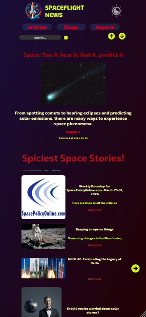

# Spaceflight App

Spaceflight 💫 news and launches.

https://spaceynews.netlify.app/

Consumes https://api.spaceflightnewsapi.net/v4/ public API with news, blogs and reports

App made with ReactJS, react-router and darkmode theme support.

 

## Available Scripts

In the project directory, you can run:

### `npm run dev`

Runs the app in the development mode.

### `npm run build`

Builds the app for production to the `build` folder.

Thank you for checking out this project 👊